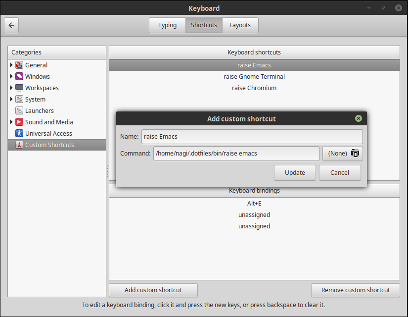

# New Development Environment Setup

### Packages

```
zsh
ack
tmux
htop
jq
git
tree
dos2unix
ruby
docker
wget
curl
```

##### On MacOS...

Grab homebrew from [brew.sh]( https://brew.sh/ )
Brew install powerline fonts

##### on Linux

sudo apt-get install fonts-powerline

```
htop
xclip
xsel

# emoji
Get more recent 'fonts-noto-color-emoji' deb file and install it.

# Decent terminal
sudo add-apt-repository ppa:webupd8team/terminix
sudo apt-get update
sudo apt-get install tilix

# Latest emacs
sudo update-alternatives --config emacs
sudo add-apt-repository ppa:kelleyk/emacs
sudo apt-get install emacsXX
```

##### Clojure...

```
rlwrap
maven
openjdk
leiningen
```

##### Arch...

```
namcap
keychain
```

### Editing

`git clone https://github.com/VundleVim/Vundle.vim.git ~/.vim/bundle/Vundle.vim`

Then start vim and `:BundleInstall`


`git clone https://github.com/syl20bnr/spacemacs ~/.emacs.d`

See the [spacemacs javascript layer README](https://github.com/syl20bnr/spacemacs/tree/master/layers/%2Blang/javascript)

`sudo npm install -g tern` linting
`sudo npm install -g eslint` linting
`sudo npm -g install js-beautify` formatting

### tmux configuration

The tmux plugins need to be installed with `^j I`.

Install xsel (or xclip) to ensure copy and paste works.

##### Arch...

  * To install powerline fonts: `yaourt -S powerline-fonts-git`
  * To change font settings in rxvt-unicode, edit ~/.extend.Xresources, then run `xrdb -merge .extend.Xresources`.

### SSH

Drop in old `~/.ssh`

### Ruby Dev

https://gorails.com for ruby / rbevn instructions

### Dropbox

https://www.dropbox.com/install-linux

### Window management

##### I3

`sudo npm install -g i3-run-or-raise`

##### Gnome3



##### MacOS

Install:

* [slate](https://github.com/jigish/slate#direct-download).
* [karabiner](https://pqrs.org/osx/karabiner/)
